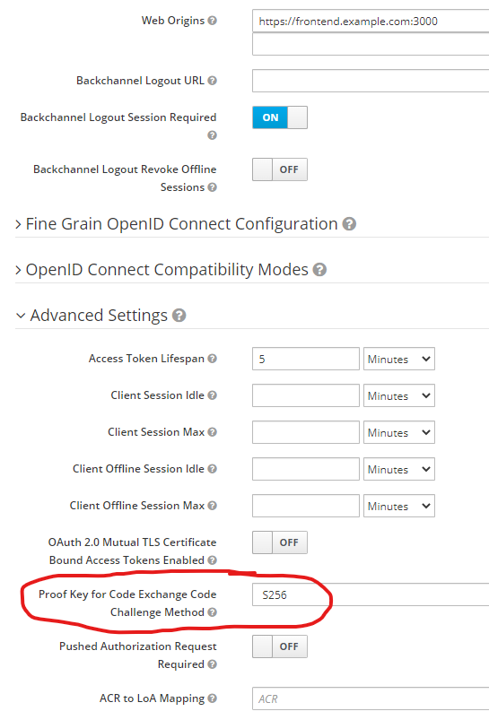
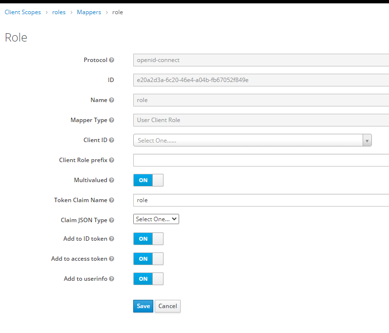

# react-webapi-oidc

Prototype of a React SPA frontend with WebAPI backend using Keycloak open source OIDC provider.

This example demonstrates authentication and authorization of a *React* single page application (SPA) frontend, backed by a *C#, .NET, WebAPI* backend, to the *Keycloak* identity provider, using *Authorization Code Flow with Proof Key for Code Exchange (PKCE)*.

## Features

- Secure authentication using Keycloak with PKCE.
- Role-based authorization integrated with ASP.NET.
- React frontend with dynamic role-based UI.
- Backend API protected with OAuth2.

## System Overview

The system consists of the following components:

- **Keycloak Identity Provider**: Handles authentication and authorization.
- **WebAPI Backend**: A .NET WebAPI application that serves protected resources.
- **React Frontend**: A single-page application that interacts with the backend and Keycloak.

### Endpoints

- **Keycloak Identity Provider**: `https://localhost:3443`
- **Keycloak Management Port**: `https://localhost:3444`
- **WebAPI Backend**: `https://localhost:3445`
- **React Frontend**: `https://localhost:3446`

> **Note**: HTTPS is mandatory for authentication. Self-signed TLS developer certificates are used for all components.

## Prerequisites

Before setting up the project, ensure you have the following installed:

- [Node.js](https://nodejs.org/) (v16 or later)
- [Visual Studio](https://visualstudio.microsoft.com/) (2022 or later) with .NET SDK
- [Docker](https://github.com/rancher-sandbox/rancher-desktop/releases) (for Keycloak setup) such as Rancher Desktop in dockerd mode, or other
- [Vite](https://vitejs.dev/) (for frontend development)

## Setup Instructions

### 1. Clone the Repository

```bash
git clone ...
cd react-webapi-oidc
```

### 2. Run the Solution

- Open the AspireKeycloack.sln from Visual Studio.
- Start the AspireKeycloack.AppHost in https mode.

## Usage

1. Open the frontend in your browser at `https://localhost:3446`.
2. Log in using the credentials configured in Keycloak.
3. Access the weather forecast data from the backend.

## Keycloak Configuration Details

### Enable Proof Key for Code Exchange (PKCE)

In the client advanced settings, set the *Proof Key for Code Exchange Code Challenge Method* to **S256**.



### Role-Based Authentication

For *Role-Based Authentication* to work, ASP.NET expects the user roles to be listed in the **role** claim (singular). Add a role mapper to the `Client Scopes` – `roles` – `Mappers`:



## Troubleshooting

- **HTTPS Issues**: Ensure a self-signed development certificate is trusted in your environment https://learn.microsoft.com/en-us/dotnet/core/tools/dotnet-dev-certs.
- **Keycloak Connection Errors**: Verify that the Keycloak container is running and accessible.

## License

This project is licensed under the MIT License. See the [LICENSE](LICENSE) file for details.